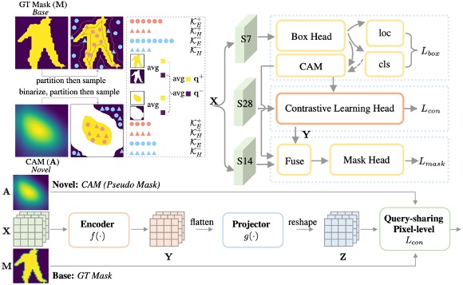

# ContrastMask: Contrastive Learning to Segment Every Thing


[arXiv](https://arxiv.org/abs/2203.09775) | [Project page](https://blog.huiserwang.site/2022-03/Project-ContrastMask)



<br>

## News
---
- 2022/05/01 Code is available.
- 2022/03/02 ContrastMask is accepted to **CVPR2022**

## Abstract
---
Partially-supervised instance segmentation is a task which requests segmenting objects from novel categories via learning on limited base categories with annotated masks thus eliminating demands of heavy annotation burden. The key to addressing this task is to build an effective class-agnostic mask segmentation model. Unlike previous methods that learn such models only on base categories, in this paper, we propose a new method, named ContrastMask, which learns a mask segmentation model on both base and novel categories under a unified pixel-level contrastive learning framework. In this framework, annotated masks of base categories and pseudo masks of novel categories serve as a prior for contrastive learning, where features from the mask regions (foreground) are pulled together, and are contrasted against those from the background, and vice versa. Through this framework, feature discrimination between foreground and background is largely improved, facilitating learning of the class-agnostic mask segmentation model. Exhaustive experiments on the COCO dataset demonstrate the superiority of our method, which outperforms previous state-of-the-arts.

<br>
<br>

## Requirements
---
- cuda == 10.1
- Pytorch == 1.7.0
- MMDetection == 2.14.0
- mmcv-full == 1.3.8

You can install all packages we need through pip.
``` shell
pip install -r requirements.txt
```

<br>
<br>

## Training and Evaluation
----
> Note: we reorganize the code from the initial version to make it more readable. There would exist some bugs... Please let me know and I will update it as soon as possible.

> Note: There exists a minor mistake in Figure.5 of our paper. The encoded feature map $\textbf{Y}$ from CLHead are added on rather than concatenated with the roi feature map $\textbf{X}$ in our code.

### Training

First of all, please update the value of ``data_root`` as your dataset path in config files.

Our code is based on MMDetection, thus the training and evaluation pipeline are the same with that in MMDetection. Here, we give an example script to train a model with res-50 backbone under 1x schedule for voc->nonvoc setting.
``` bash
bash run_train.sh
```
or
``` bash
bash ./iscript/dist_train.sh iconfig/contrastmask_res50_fpn_coco_1x_nonvoc2voc.py --deterministic --seed 0 --work-dir /home/huiser/Desktop/Codes/ContrastMask/test_dir --work_id 20220430 --exp_details reorganized_code_for_github
```
If you want to try the voc->nonvoc setting, you can revise the term ``base_set`` and ``novel_set`` in config file from nonvoc to voc and voc to nonvoc, respectively.

## Evaluation
Given checkpoint path ``ckpt_path``, we can evaluate the mask AP and box AP for novel categories.

``` bash
bash ./iscript/dist_test.sh iconfig/contrastmask_res50_fpn_coco_1x_nonvoc2voc.py $ckpt_path --eval segm bbox \
--out result.pkl 
```

<br>
<br>

## Pretrained Models
---
> Note: Due to the random sampling operation for generating different types of queries and keys, the final performance of the model would have a minor perturbation of about **$\pm$ 0.2** mAP.

> We will update the download links later.

| Backbone | setting | sche | download |
| :---- | :---- | :----: | :---- |
| ResNeXt-50 | voc -> nonvoc | 3x   | OneDrive <br> SJTU-Box|
| ResNeXt-50 | nonvoc -> voc | 3x  | OneDrive <br> SJTU-Box|
| ResNeXt-101 | voc -> nonvoc | 3x  | OneDrive <br> SJTU-Box|
| ResNeXt-101 | nonvoc -> voc | 3x  | OneDrive <br> SJTU-Box|

<br>
<br>

## Citation
``` bibtex
@InProceedings{Wang_2022_CVPR_ContrastMask,
    author = {Wang, Xuehui and Zhao, Kai and Zhang, Ruixin and Ding, Shouhong and Wang, Yan and Shen, Wei},
    title = {ContrastMask: Contrastive Learning to Segment Every Thing},
    booktitle = {Proceedings of the IEEE/CVF Conference on Computer Vision and Pattern Recognition (CVPR)},
    month = {June},
    year = {2022}
}
```

<br>

## Acknowledgement
- We thanks for the excellent [MMDetection](https://github.com/open-mmlab/mmdetection) which makes us start our work easily.
